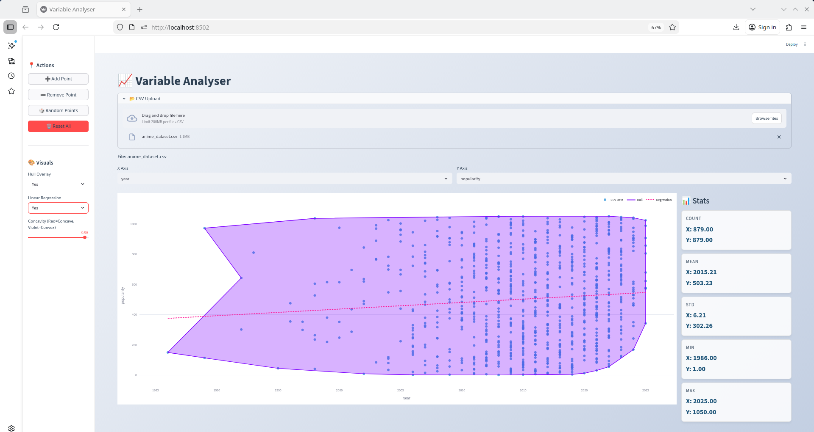

# 2D Graph analyser - Friendly visualiser

## Introduction

Ever got a large csv 📊 file and you wanna compare 2 columns together? But you end up facing tons of issues in parsing, formatting, calculating, etc. running into NaN (➗0️⃣💥) errors for more times than Ferrari (🏎️♞) have lost a podium? In that case this website has you sorted. Simply upload your csv file constraint to:
```math 
    \leq 10\ MB
```

and you can see the scatter plot visualisation for yourself.

Additionally you can play around by manually adding and removing singular points too (points not in the csv).

## Setup

The project is based on streamlit tool of Python. 

It works with 
1. streamlit for the web interface.
2. pandas and numpy for data cleaning.
3. plotly for the dynamic graph.
4. shapely for geometric visualisation.

## How to install and run

1. Create any directory to store the project in.
2. Clone the repository and copy all the contents of the directory __2D GRAPH ANALYSER?SOURCE CODE__ to your directory.
3. Set up venv in your directory with:
    - Open terminal in your directory (normal bash/zsh in case of linux or wsl in case of windows)
    - Enter ```python -m venv venv``` to create venv
    - Enter ```source venv/bin/activate``` to activate it
    - Enter ```venv/bin/pip install -r requirements.txt``` to install dependencies
    - Enter ```venv/bin/streamlit run app.py``` to start app
    - Open [Analyser App](http://localhost:8501) and enjoy !
4. In case of any issues do leave a comment down inside my repo to tag me !

## Demo




https://github.com/user-attachments/assets/8a1b8aa3-d587-4db3-bcee-b0640d19ca1f


