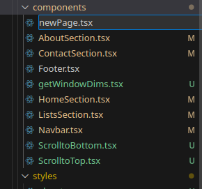
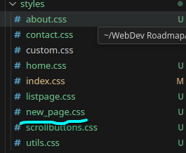
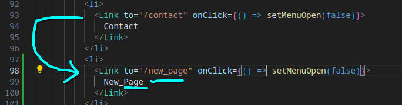
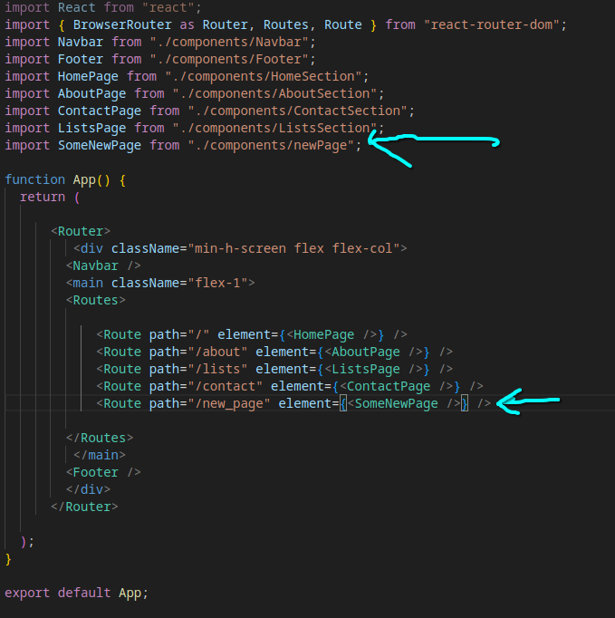
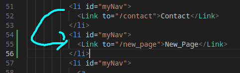
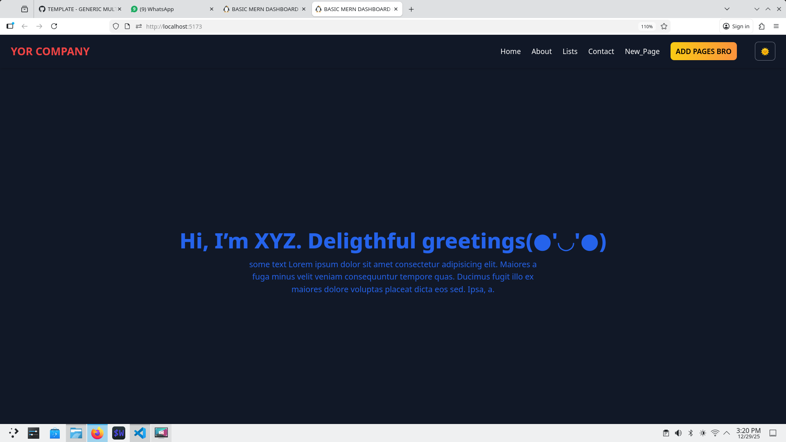
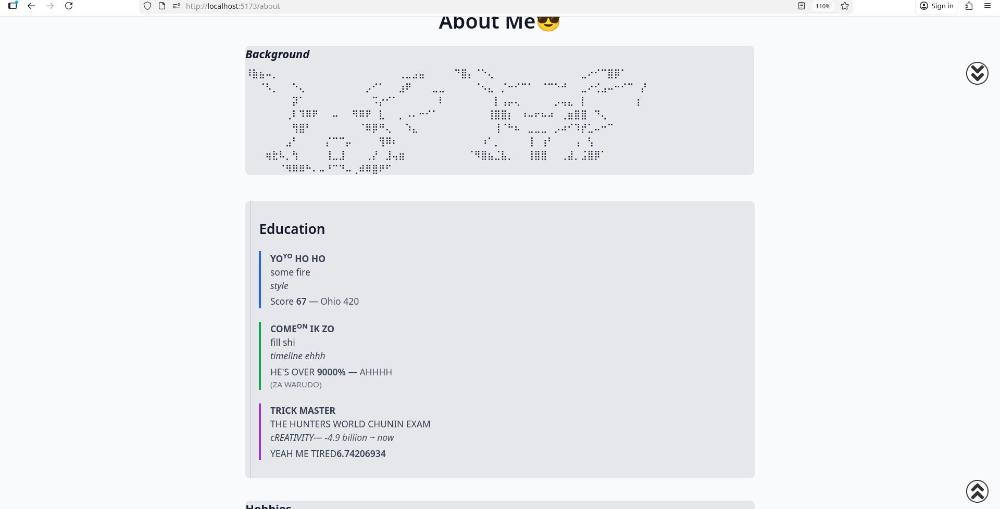
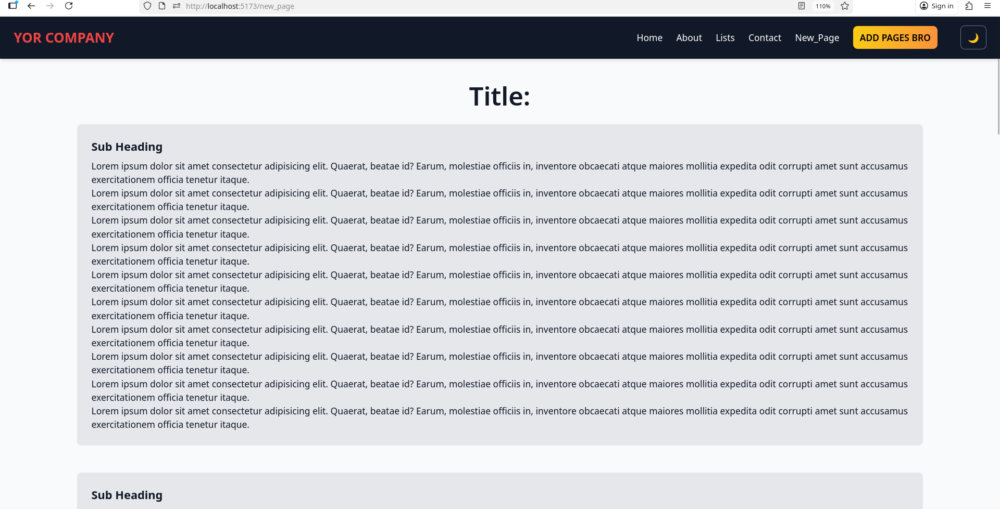

# React Frontend Dashboard Template

## Introduction

Basic Idea: 
1. You go to Hackathon
2. You got a crazy idea
3. You realise, you have no home page
4. You spend half the hackathon debugging React errors.
5. Your backend is None
6. Your day went bad


To avoid this we have made this template with some nice touches like dark/light mode, scroll to top/bottom, mobile responsiveness for navbar.

Simply clone or copy the source code. Edit Navbar and App files to create New Routes, add your new components, link them with their new css files and connect to your backend.

## Setup

The project is based on React mainly. 

It works with 
1. TypeScript for React Scripts
2. Tailwind css for styling 
3. Html for basic skeleton

## How to install and run

1. Create any directory to store the project in.
2. Clone the repository and copy all the contents of the directory __DASHBOARD TEMPLATE REACT/SOURCE CODE__ to your directory.
3. Set up venv in your directory with:
    - Open terminal in your directory (normal bash/zsh in case of linux or wsl in case of windows)
    - Make sure npm is installed. Enter ```npm install``` to resolve dependencies
    - Run ```npm run dev``` to test
    - Open [Dashboard App](http://localhost:5173) and enjoy !
4. In case of any issues do leave a comment down inside my repo to tag me !

## Adding New Page

1. <b>First Create New Component and stylesheet</b>




2. <b>Edit App.tsx</b>



3. <b>Edit Navbar.tsx</b>




4. <b>Edit New Component</b>

A basic template is

<code>

    import React from "react";
    import ScrollToTop from "./ScrolltoTop";
    import ScrollToBottom from "./ScrolltoBottom";
    import "../styles/new_page.css";

    const SomeNewPage: React.FC = () => {
    // Some interface
    interface CustomDivProps {
        count: number;
    }

    const someObject: React.FC<SomeObject> = () => {
            return (
            <div
                id="box"
                className="bg-gray-200 p-5 sm:p-6 rounded-xl shadow-sm border border-gray-200"
            >
            Some stuff
            </div>
        );
    };
    return (
        <main className="container mx-auto px-4 sm:px-6 py-8 sm:py-12">
        <ScrollToTop />
        <ScrollToBottom />
        <h2
            id="title_head"
            className="text-2xl sm:text-3xl font-semibold mb-8 text-center"
        >
            {" "}
            Title:{" "}
        </h2>
        <div></div>
        </main>
    );
    };

    export default SomeNewPage;
>

## Demo






