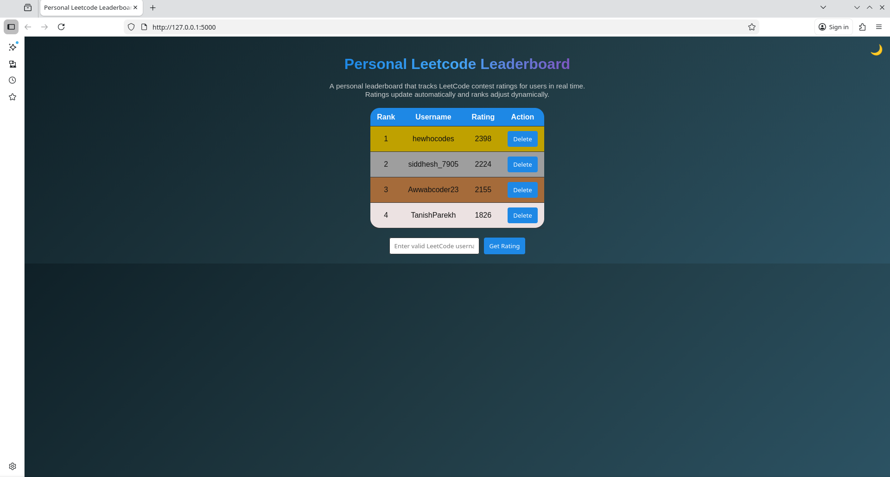

# Personal Leetcode Leaderboard

## Introduction

Wanna compare your Leetcode Rating with your friends while learning basic CRUD, and API calls? Say no more and see this short concise flask project.

## Setup

The project is based on Python, mainly flask. 

It works with 
1. flask for the routing
2. flask_sqlalchemy for ORM (Object Relational Mapping) based Database handling
3. html/css/js for simple but good looking frontend
4. some local database (like postgres)

## How to install and run

1. Create any directory to store the project in.
2. Clone the repository and copy all the contents of the directory __Awwab_Wadekar_Dynamic_Leetcode_Leaderboard/source_code__ to your directory.
3. You will need to setup a local database like postgres or mysql.
4. Set up venv in your directory with:
    - Open terminal in your directory (normal bash/zsh in case of linux or wsl in case of windows)
    - Enter ```python -m venv venv``` to create venv
    - Enter ```source venv/bin/activate``` to activate it
    - Enter ```venv/bin/pip install -r requirements.txt``` to install dependencies
    - Enter ```venv/bin/python app.py``` to start app
    - Open [Personal Leetcode Leaderboard](http://127.0.0.1:5000) and enjoy !
5. In case the port shows up as in use and the app doesn't work go to [app.py](app.py), scroll to the last line and change port number in  ```app.run(debug=True) ``` to some other port number(like **6769** or something random).
6. In case of any issues do leave a comment down inside my repo to tag me !

## Demo




https://github.com/user-attachments/assets/d3652be2-d665-4e88-8d6a-c5a6501dd79e


