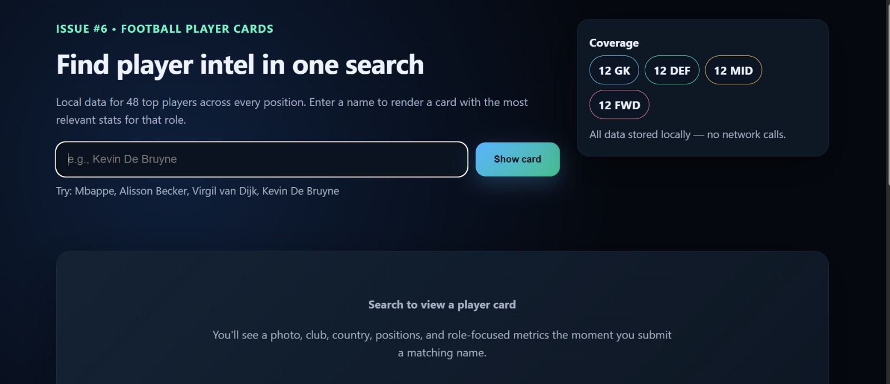
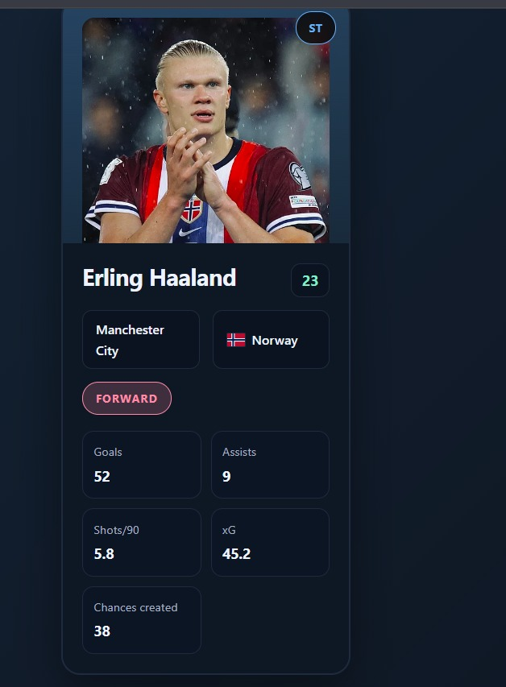

# Football Player Cards(Issue-6 | Difficulty:Medium)

## Setup
1. Clone the repository:
   ```bash
   git clone <repository-url>
   cd "Legend-of-the-Web-Verse/FOOTBALL PLAYER CARDS/SOURCE CODE"
   ```
2. Serve the project locally (example using Python):
   ```bash
   python -m http.server 8000
   ```
3. Open your browser and visit: `http://localhost:8000/index.html`

## Files
- `index.html` — Main HTML markup and page structure.
- `style.css` — All visual styles and layout rules.
- `script.js` — Player data, rendering logic, search, and image handling.
- `assets` - A folder to contain relevant screenshots or other material
- `README.md` — This file.

## Project explanation
This is a small static single-page app that displays football player cards. Enter a player name to render a card that shows a photo, club, country, position, age, and role-focused metrics. The app attempts to fetch real player photos from Wikimedia and falls back to an initials avatar when a thumbnail is not found.
We have kept differentiation between features for different positions, as football roles vary according to position. Goals and Assists for forwards, passes for midfielders, Tackles for defenders are some of the stats we have used for this feature.

## Tech stack
- HTML, CSS, and vanilla JavaScript
- Wikipedia API (used at runtime to fetch thumbnails)
- Static server for local testing (e.g., Python `http.server`)

## Features
- Search and render player cards from a local dataset.
- Asynchronous fetching of Wikimedia thumbnails for real player photos (cached in-session).
- Graceful fallbacks: initials avatars and image placeholder states.
- Responsive layout with a roster grid for quick selection.

## Screenshots


